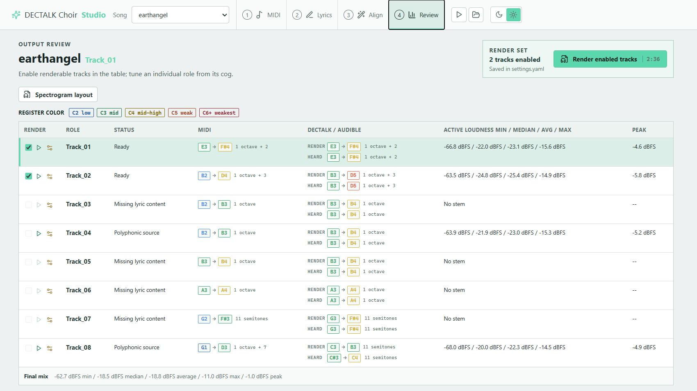

# DECTALK Choir
Making a retro speech synth sing! Able to work with polyphonic choral music. All written in Python3 and runs on Windows. Also generate spectrogram animation for the voices.

## Start Here

DECTALK Choir has two connected workflows:

- **[Choir Studio](choir_studio/README.md)**: the desktop editor for importing and inspecting MIDI, drafting and aligning lyrics, tuning roles, and starting renders.
- **[Choir Renderer](#choir-renderer)**: the underlying Python compiler that turns configured MIDI and lyric files into DECtalk stems, final audio, and optional spectrogram video.

## Process Map

```text
MIDI + lyric transcript
         |
         v
  Choir Studio (Tauri desktop app)
  inspect -> draft -> align -> tune -> choose roles
         |
         | JSON bridge invokes established Python services
         v
  choir.py (renderer)
  MIDI + settings.yaml + lyric candidates -> DECtalk stems -> final mix/video
```

Studio owns the editing experience. `choir.py` remains the single rendering
engine, so command-line renders and Studio renders use the same settings,
lyrics, pitch rules, DECtalk commands, audio processing, and output layout.

## Choir Studio

[](choir_studio/assets/studio-overview.mp4)

**[Watch the short Choir Studio overview (MP4)](choir_studio/assets/studio-overview.mp4)** to see the MIDI source view and populated Review workspace with render readiness, pitch ranges, and loudness statistics.

[](https://www.youtube.com/watch?v=oPg8LVGdd4I)

**[Watch the DECTALK Choir demonstration on YouTube](https://www.youtube.com/watch?v=oPg8LVGdd4I).**

## Background
Dectalk is a text to speech synthesizer released in 1983. It was famously used by Steven Hawking, and was included in the game Moonbase Alpha to read chat messages aloud. The system allows pronunciation phonemes, even inputting specific pitches and durations. Players of Moonbase Alpha quickly realized that these could be used to sing songs. I think this is absolutely delightful, and really wanted to play with this myself. Rather than copy-paste lines of text into the game, I tracked down a standard version of DECTalk and compiled it line by line.

## Choir Renderer
For a source checkout, create a Python virtual environment and install the runtime dependencies:

```powershell
py -3.11 -m venv .venv
.\.venv\Scripts\python.exe -m pip install -r requirements.txt
```

Contributors can install `requirements-dev.txt` instead to include the test runner. FFmpeg and Rubber Band are external executables and are not installed by pip.

Each song is saved in a folder under /songs. Before compilation, specify source MIDI in `inputs/`, lyrics in `inputs/lyrics/*.txt`, and settings in `settings.yaml`. Run choir.py to compile.
choir.py Usage: python3 choir.py \[options\] \[songFolder\]
Example:
> python3 choir.py -vis AuldLangSyne

Outputs are saved to `songs/<Song>/outputs/`. One folder for each track is generated to save partial outputs. **_tracks** contains each individual track's compiled output, **_animation** contains generated spectrogram animations, and **_finished** contains the final compiled audio and video.

Three example songs are included, and I would recommend duplicating and modifying one of them instead of starting from scratch.

## MIDI
In `songs/<Song>/inputs/`, choir.py checks for a single .mid file. I use LMMS to work with MIDI, but other software *should* be able to export compatible files. For each output track in settings.yaml, `TRACK_FILENAME` selects the MIDI track to read. If `TRACK_FILENAME` is omitted, the settings key is used as the MIDI track name. Each track should be monophonic, only playing one note at a time. Split chords into separate tracks. The only data used are note positions, timings, and velocity.

Choir Studio marks configured tracks with simultaneous notes in the Align rail. Open the branch control on that track to preview the minimum monophonic voice lanes and their note counts. The splitter can export a separate MIDI or replace the working MIDI with a one-time `.bak` backup; every untargeted track and every source note is preserved.

### Lyrics
Lyrics should be saved as a .txt file in `songs/<Song>/inputs/lyrics/`. Lyrics are run one line at a time, so desync issues in playback can frequently be fixed by separating words into individual lines. Internally, words are split up into phonemes by **pyFuncs/PhonemeProcessing.py**. If a word can't be converted, try replacing it with a homophone.
Lines starting with **\#** are comments and will be ignored.
> \# Start Repeat

Words starting with **`** are not split into phonemes, allowing very specific input if you're familiar with how DECtalk works.
> `kahl

If a word needs to be played across multiple notes, add X* before it to play X notes across it. The code will attempt to match syllables to notes.
> 2*christmas is here

To specify a number of notes for each vowel, add numbers separated by |. Each vowel will pronounce that many syllables.
> 1|1|christmas is here

Begin a line with !X to repeat X times.
> !2 ding dong

Begin a line with `[timestamp]` to force the partial's start time. Add `|duration` to also force the partial length. Timestamps without units are seconds; durations without units are milliseconds. Durations can also use `s`, `ms`, or clock syntax.
> [0:40|5000] built for two

If the compiled line is shorter than the requested duration, silence is appended. If it is longer, the end of the line is trimmed.

### Lyric Sync Assistant

For a faster first pass, write plain lyrics in `songs/<Song>/inputs/lyrics/<Part>.transcript.txt` or point the tool at any text file. A transcript is immutable once captured by Studio; delete it manually before intentionally replacing the original input. The assistant reads the configured MIDI source track, detects lyric phrases from rests, and writes a working draft using the existing `X*word` and `X|Y|word` syntax.

Prefix an aligned word with `~` when it should use normal DECTALK speech instead of pitched singing while retaining its claimed MIDI time, for example `2*~hello`. Choir Studio exposes this as a compact toggle on the selected word.

Example raw inputs live under `tools/lyric_sync_assistant/examples/`; they are seed inputs reverse-engineered from one curated track per original example song.

```powershell
.\.venv\Scripts\python.exe tools\lyric_sync_assistant\assistant.py DaisyBell Vocals --auto-lines --overwrite
.\.venv\Scripts\python.exe tools\lyric_sync_assistant\assistant.py DaisyBell Vocals --text-file songs\DaisyBell\inputs\lyrics\Vocals.transcript.txt --output songs\DaisyBell\outputs\lyrics_drafts\Vocals.txt --overwrite
```

Drafts are written to `songs/<Song>/outputs/lyrics_drafts/<Part>.txt` by default and are never render inputs. Transcript drafts use renderer-valid timestamped lyric lines, preserving pasted `[timestamp]` or `[timestamp|duration]` prefixes and deriving starts from MIDI for plain input. A single untimestamped bulk block is automatically split at MIDI phrase rests. Diagnostic comments are opt-in with `--comments`. Only the aligned `songs/<Song>/inputs/lyrics/<Part>.txt` configured by `LYRICS_FILENAME` is rendered. Publish it through Studio **Apply to source** or `alignment.py --apply --overwrite` after review.

The phrase and word-boundary thresholds are BPM-relative by default, and can be overridden with `--phrase-gap-ms`, `--word-gap-ms`, and `--tight-gap-ms`. Without `--auto-lines`, source line breaks are preserved as lyric-phrase hints while note counts are aligned globally to the MIDI track. With `--auto-lines`, source words are flattened and aligned globally, then the output is split at detected MIDI rest phrases.

Legacy workspaces can migrate their earlier transcript artifacts safely with `python tools/migrate_lyric_transcripts.py --apply --remove-raw`. The command creates each missing immutable transcript from the best recoverable pre-alignment source, verifies the copy, and only then removes the obsolete artifact.

The assistant can benchmark itself against the perfected example lyric files:

```powershell
.\.venv\Scripts\python.exe tools\lyric_sync_assistant\assistant.py --validate-examples --auto-lines
.\.venv\Scripts\python.exe tools\lyric_sync_assistant\assistant.py DaisyBell Vocals --validate --auto-lines
```

Validation reports note-allocation error, exact word allocation percentage, word-to-note boundary error, line-boundary error, and warning counts. The word-to-note boundary metric is the most useful signal for whether held words and syllables landed on the same note spans as the curated lyrics.

## Settings
Settings.yaml holds both general settings and per track settings. All settings are optional, and a default will be added by choir.py if none is specified.

### General Settings

**noteOffset**: DECtalk uses a different pitch encoding than MIDI. With the default `noteOffset: -48`, the raw emitted pitch is `MIDI pitch - 48`, so MIDI `48` (`C3`) becomes DECTALK pitch `0`, MIDI `69` (`A4`) becomes DECTALK pitch `21`, and MIDI `84` (`C6`) becomes DECTALK pitch `36`. Change this only when you intentionally want to transpose the song before DECTALK rendering.

**minDectalkPitch / maxDectalkPitch**: Inclusive DECTALK pitch bounds. Defaults are `0` through `36`, which maps to `C3` through `C6` in the project pitch model. The compiler octave-wraps every emitted pitch into this range before writing DECTALK text, so bad MIDI or a manual track shift should not leak an ugly out-of-range pitch. The range must span at least one octave so all 12 pitch classes can still be represented.

Pitch classes are preserved as integers. There is no `#` spelling in the DECTALK output, but sharps are supported: pitch `% 12 == 1` is `C#`, `3` is `D#`, `6` is `F#`, `8` is `G#`, and `10` is `A#`.

**pitchVolumeBoostStart / pitchVolumeBoostDbPerSemitone / pitchVolumeBoostMaxDb**: Song-level defaults for pitch-dependent gain. These feed the per-track `PITCH_VOLUME_BOOST_*` settings. A useful starting point for quiet high notes is `pitchVolumeBoostStart: 24`, because pitch `24` is `C5` in the project pitch model. The boost threshold uses the final audible pitch after `OCTAVE_BOOST`, not only the temporary DECTALK render pitch.

**noteNormalizeReferenceMin / noteNormalizeReferenceMax / noteNormalizeTargetDbfs / noteNormalizeMaxBoostDb / noteNormalizePeakCeilingDbfs**: Song-level defaults for per-note voice leveling. `noteNormalizeTargetDbfs: auto` uses the voice's own notes in the reference range when available, defaulting to `7` through `16` (`G3` through `E4`), then boosts whole MIDI-note groups toward that target up to `noteNormalizeMaxBoostDb` and the peak ceiling. This is the preferred way to compensate for DECtalk notes that are weak in some registers without changing consonant/vowel balance inside the note.

**ignoreMidiVelocity / velocityVolumeScaleDb**: MIDI velocity is ignored by default (`ignoreMidiVelocity: true`), independent of the configured scale. Set `ignoreMidiVelocity: false` and choose a positive `velocityVolumeScaleDb` only when a MIDI performance intentionally encodes dynamics that should survive normalization.

Consonants are played as separate phonemes. How long each consonant is played for can be tweaked with the following.
**consonantFractionTarget**: The maximum time taken up by consonants across the whole word.
**consonantMinMs**: Minimum time per consonant (mS)
**consonantMaxMs**: Maximum time per consonant (mS)

### Per Track Audio Settings
The key under `Tracks:` is the output name used for folders, text chunks, WAV stems, and the final mix. `LYRICS_FILENAME` and `TRACK_FILENAME` can point that output to different lyric and MIDI sources.

**LYRICS_FILENAME**: Name of file to read lyrics from. Defaults to the output name. Allows different parts to read from the same lyrics file for simplicity.

**TRACK_FILENAME**: Name of the MIDI track to read. Defaults to the output name. Allows an output stem to use a differently named MIDI track, or multiple output stems to share the same MIDI source.

**PITCH_SHIFT**: Per-track musical transposition in semitones after the song-level `noteOffset`. Use this when two tracks share the same MIDI notes but should sing at different octaves or intervals.

**OCTAVE_BOOST**: Render-cleanup shift in semitones. DECtalk is asked to sing this many semitones lower for stability, with note durations stretched to match; after rendering, the WAV is sped back up. Pair with `PITCH_SHIFT` for octave duplicate tracks, e.g. `PITCH_SHIFT: 12` and `OCTAVE_BOOST: 12`.

Negative `OCTAVE_BOOST` is valid for very low final notes: DECtalk is asked to sing higher/shorter, then the WAV is slowed back down. If the MIDI already contains the desired final octave for each part, `PITCH_SHIFT` is usually unnecessary; use `OCTAVE_BOOST` only to move the temporary DECTALK-rendered pitch into a stable register.

Avoid large negative boosts as a default. `OCTAVE_BOOST: -12` can be useful for C2-range bass references, but `-24` has produced strong low-frequency pulse/formant artifacts in practice.

Run `python tools/create_octave_boost_reference_song.py` to regenerate the checked-in octave reference. It previews complete chromatic octaves from C2 through C6 using boosts `-12`, `0`, `12`, and `24`. The `+36` three-octave boost is intentionally excluded because it does not render reliably.

**VOLUME_ADJUST_DB**: Will adjust volume level of each track in decibels. Positive is louder, negative is quieter, and 0 is the same. I usually make higher tracks louder to be audible.

**PITCH_VOLUME_BOOST_START / PITCH_VOLUME_BOOST_DB_PER_SEMITONE / PITCH_VOLUME_BOOST_MAX_DB**: Optional pitch-dependent gain curve for tracks that get quiet on high notes. Final audible pitches above the start value are boosted by the per-semitone amount, capped by the max dB value.

**NOTE_NORMALIZE_REFERENCE_MIN / NOTE_NORMALIZE_REFERENCE_MAX / NOTE_NORMALIZE_TARGET_DBFS / NOTE_NORMALIZE_MAX_BOOST_DB / NOTE_NORMALIZE_PEAK_CEILING_DBFS**: Per-track overrides for the song-level note normalizer. The normalizer groups consonants and vowels from the same MIDI note before measuring and boosting, so the note gets leveled as one musical event.

`NOTE_NORMALIZE_PEAK_CEILING_DBFS` is a bidirectional post-boost safety guard: it attenuates notes already above the ceiling as well as limiting requested positive correction. `STEM_PEAK_CEILING_DBFS` applies the same final guard after a complete role stem is assembled. Both default to `-1.0 dBFS`. `finalMixPeakCeilingDbfs` is the song-level final-mix guard and also defaults to `-1.0 dBFS`; the final mix is accumulated at 32-bit width before this ceiling is applied.

**IGNORE_MIDI_VELOCITY / VELOCITY_VOLUME_SCALE_DB**: Per-track velocity controls. `IGNORE_MIDI_VELOCITY` defaults to `true`, keeping velocity out of gain calculations. When set to `false`, `VELOCITY_VOLUME_SCALE_DB` defines the opt-in dynamic range.

**SEGMENT_NORMALIZE_PITCH_START / SEGMENT_NORMALIZE_TARGET_DBFS / SEGMENT_NORMALIZE_MAX_BOOST_DB**: Legacy/surgical measured loudness lift for individual generated phoneme segments. Prefer note normalization for normal singing because segment normalization can change the balance inside a syllable. Set max boost to 0 to disable.

**DEC_SETUP**: Add a bit of scripting to the beginning of each text file read by DECtalk to change settings.
\[:np\] sets the voice to perfect paul, the most popular voice. Other voices include \[:np\] \[:nb\] \[:nh\] \[:nd\] \[:nf\] \[:nu\] \[:nr\] \[:nw\] & \[:nk\]
\[:dv hs 95\] changes the head size to be 95% standard. I usually increase head size for lower voices as I think it sounds better.
Choir Studio Review exposes these voice commands as a beta per-track selector. Saving replaces only the `[:n?]` command and preserves the rest of `DEC_SETUP`; its Auto-normalize baseline is currently measured only for `[:np]`.
There are a ton of other settings to play with that I haven't taken the time to learn, I've been mostly focused on the synchronization and playback.


### Per-track spectrogram settings

Final spectrogram videos are encoded as H.264 at CRF 23 with AAC audio. The
song-level `spectrogramVideo.deleteIntermediateAnimations` setting defaults to
`true`: after a successful final MP4 composition it removes the much larger
lossless per-track clips and any legacy `animation.mp4`. Choir Studio exposes
this policy as a checkbox in the spectrogram layout view. Disable it only when
the intermediate clips are needed for debugging or external editing; failed
video composition never triggers cleanup.

Spectrogram layout and text overlays belong to a nested `SPECTROGRAM` mapping under each track. Choir Studio edits this mapping directly:

```yaml
Tracks:
  Soprano:
    DEC_SETUP: "[:nf][:dv hs 90]"
    SPECTROGRAM:
      COLOR_HSB: [328, 70, 97]
      POSITION: [0.5, 0, 0]
      LABEL: "Soprano"
      LABEL_ENABLED: true
      LABEL_POSITION: "top-left"
      LABEL_SHOW_VOICE: true
      LABEL_SHOW_HEAD_SIZE: true
      LABEL_FONT: "choir"
      LABEL_FONT_SIZE_PERCENT: 7
      CURRENT_WORD_ENABLED: true
      CURRENT_WORD_POSITION: "bottom-center"
      CURRENT_WORD_FONT: "choir"
      CURRENT_WORD_FONT_SIZE_PERCENT: 10
      CURRENT_WORD_USE_TRACK_COLOR: false
```

`POSITION` is `[size, left, top]`, expressed as fractions of the final video frame. Text positions support the nine combinations of `top`, `center`, or `bottom` with `left`, `center`, or `right`. Font choices are `choir`, `sans`, `serif`, and `mono`; sizes are percentages of the track region height. Current-word text is white unless `CURRENT_WORD_USE_TRACK_COLOR` is enabled. Its saved alignment timing automatically includes the renderer's one-second output lead-in.

The generator renders enabled track clips concurrently, then composites them in configured order and muxes the final audio once. Lossless intermediate clips are deleted only after the final video succeeds.
